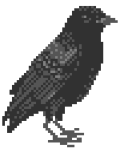

### 👋🏻 Hi there, I'm Shamlan!

---

I'm a passionate <b>*H4cker*</b> and an <b>open-source</b> developer who loves crafting <code>&lt;code&gt;</code> and building projects that actually make a difference.

---

### 🔗 Social
- [**YouTube**](https://www.youtube.com/@S𱎫) 🎥
- [**GitHub**](https://github.com/Shamlan311) 🐙
- [**Discord**](https://discord.gg/Hw3Kh4xgSE) 💬
- [**Twitter**](https://www.x.com/ShamlanAlt) 🐦

### 🛠 Tech Stack
<### 🛠 Tech Stack
      

---

✨ <b>Achievements</b>

